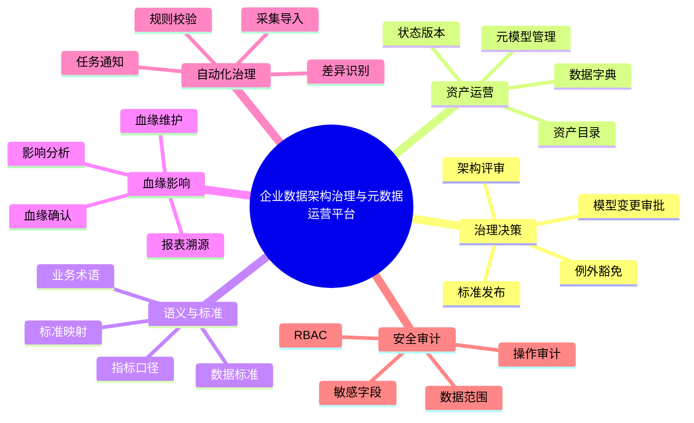
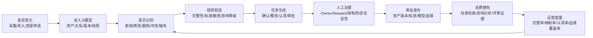
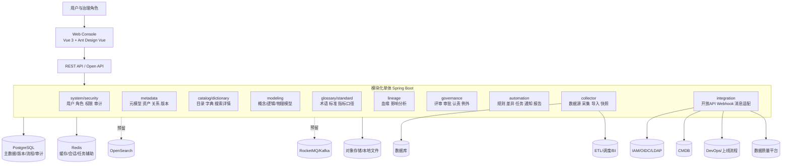

# 业务与应用架构视图 v0.1

## 1. 定位

本文档补充平台的业务架构与应用架构视图，用于连接总纲、PRD、应用架构、元模型、接口集成和治理流程设计。本文不改变既有 ADR：首期仍采用 DDD 分层的模块化单体、PostgreSQL 主存储、本地领域事件和可插拔 MQ、搜索、工作流适配。

## 2. 业务能力地图

## 3. 关键参与方

| 参与方 | 核心职责 |
| --- | --- |
| 平台管理员 | 用户、角色、权限、数据源、模板和系统配置 |
| 企业架构师 | 架构评审、系统依赖、架构合规和例外确认 |
| 数据架构师 | 数据域、模型设计、模型评审和标准引用确认 |
| 数据治理管理员 | 标准术语、治理规则、责任体系和治理看板 |
| Data Steward | 字典维护、定义补齐、血缘确认和整改处理 |
| 系统 Owner | 系统资产确认、接口维护、模型变更提交 |
| 数据 Owner | 业务定义、指标口径、数据责任和授权确认 |
| 安全合规人员 | 分类分级、敏感字段、导出控制和审计要求 |
| 普通用户 | 查询资产定义、口径、来源、血缘和责任人 |
| 外部系统 | IAM、CMDB、数据库、ETL/调度、BI、DevOps、数据质量平台 |

## 4. 业务价值流

## 5. 应用组件架构

## 6. 限界上下文与模块映射

| 限界上下文 | 对应能力 | 主要对象 | 上游依赖 | 对外输出 |
| --- | --- | --- | --- | --- |
| system/security | 安全审计 | User、Role、Permission、AuditLog | IAM | 权限校验、审计记录 |
| metadata | 元模型与资产底座 | MetaType、Asset、Relation、Version | collector、import | 资产权威版本 |
| catalog/dictionary | 资产消费与字典维护 | CatalogAsset、FieldDictionary、Tag | metadata、standard、glossary | 检索、详情、订阅 |
| modeling | 数据模型管理 | ConceptEntity、LogicalEntity、PhysicalModel | metadata、standard | 模型版本、映射关系 |
| glossary/standard | 语义与标准 | BusinessTerm、DataStandard、Reference | governance | 标准发布、整改清单 |
| lineage | 血缘与影响 | LineageRelation、ImpactAnalysis | metadata、collector | 血缘图、影响报告 |
| governance | 治理流程 | ReviewCase、ApprovalTask、Responsibility | metadata、lineage、standard | 审批记录、评审证据 |
| automation | 自动化治理 | Rule、Diff、Task、Notification、Report | metadata、collector、governance | 任务、通知、报告 |
| collector | 采集导入 | DataSource、CollectTask、ImportBatch | 外部数据源 | 快照、差异事件 |
| integration | 开放集成 | IntegrationApp、Webhook、ExternalMapping | 各应用服务端口 | API、事件、外部映射 |

## 7. 集成点

| 集成对象 | 方向 | 方式 | 归属模块 | 边界约束 |
| --- | --- | --- | --- | --- |
| IAM/OIDC/LDAP/AD | 入站 | 用户组织同步、认证接入 | system/security、integration | 首期保留本地账号兜底 |
| CMDB | 入站 | 系统、应用、负责人、生命周期同步 | collector、metadata | CMDB 是运行事实来源，平台形成治理定义 |
| 数据库 | 入站 | 只读采集系统表、Schema、表、字段 | collector | 禁止采集账号拥有写权限 |
| ETL/调度/BI | 入站 | 任务、依赖、数据集、报表、指标采集 | collector、lineage | 首期可先接口规范，逐步适配 |
| DevOps/上线流程 | 双向 | 变更单、发布单、评审结果关联 | governance、integration | 架构评审结果作为上线前置证据 |
| 数据质量平台 | 双向 | 质量规则、质量结果、问题单关联 | automation、governance | 不替代质量执行平台 |
| 消息平台 | 出站/入站 | 领域事件与集成事件 | integration、automation | 业务代码只依赖事件端口 |
| Open API/Webhook | 出站/入站 | 资产、标准、血缘、任务查询与通知 | integration | 必须经过权限、审计和幂等控制 |

## 8. 首期边界

首期必须跑通：资产导入、资产目录、数据字典、元模型、标准术语、基础血缘、影响分析、架构评审、模型变更、责任认领、权限审计和自动化任务闭环。

首期不承诺：微服务拆分、复杂 BPMN 建模、全量字段级血缘、全套 TOGAF 制品库、全量 ETL/BI 适配、自动审批通过。
